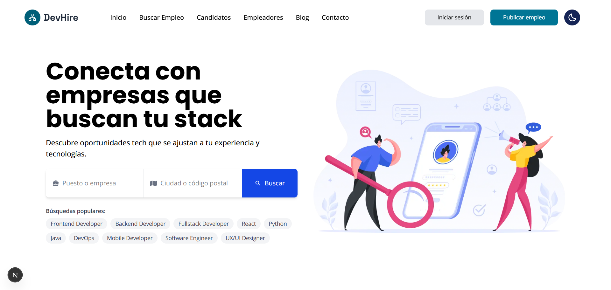
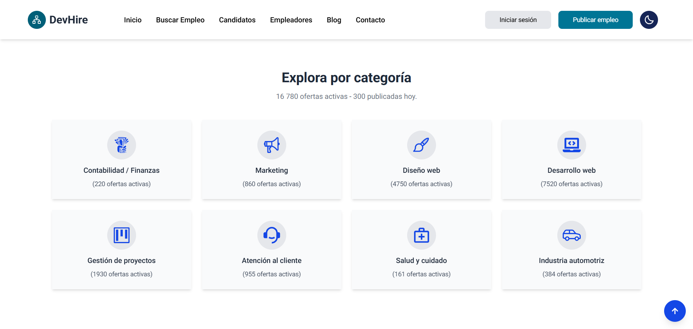
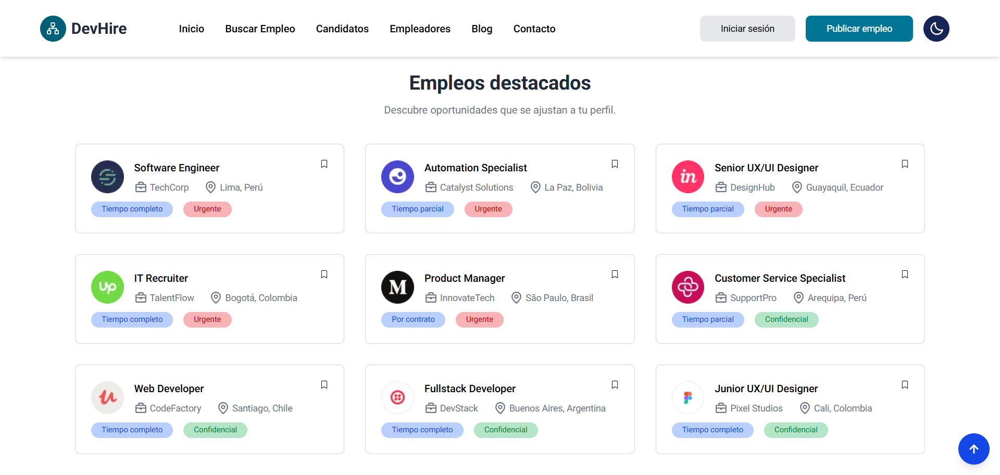
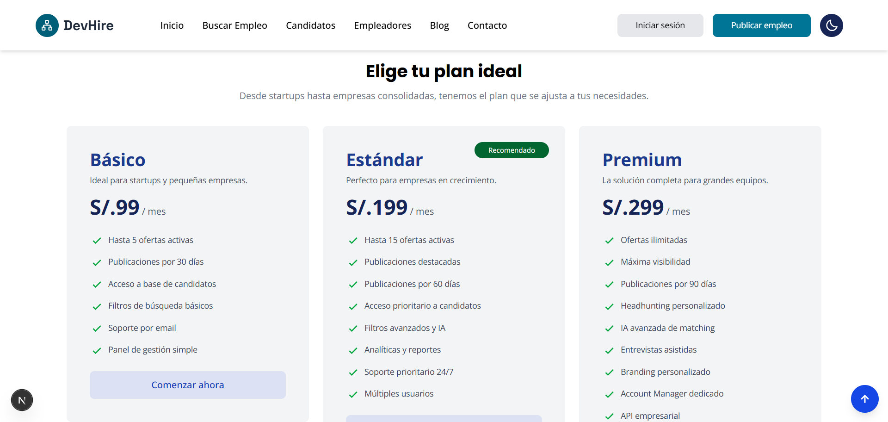

# 💼 DevHire · Conectando Talento Tech con Oportunidades 🚀

[](https://dev-hire-three.vercel.app/)

Bienvenido a **DevHire**, la plataforma líder en Latinoamérica que conecta desarrolladores talentosos con empresas innovadoras. Creemos que **cada línea de código merece el proyecto perfecto, cada stack tiene su oportunidad ideal y cada desarrollador merece crecer profesionalmente**.

Con un diseño moderno, intuitivo y completamente responsive, **DevHire** facilita tanto la búsqueda de empleo como la contratación de talento tech excepcional. 💻✨

---

## 🌟 Características Principales

- 🔍 **Búsqueda avanzada de empleos** con filtros por tecnologías, ubicación y modalidad.
- 🏢 **Empresas verificadas** que confían en nuestra plataforma para contratar.
- 🎯 **Matching inteligente** entre skills de desarrolladores y requisitos de empresas.
- 📱 **Totalmente responsive**, optimizado para móviles, tablets y escritorio.
- 🌓 **Modo claro/oscuro** con persistencia de preferencias.
- ✨ **Animaciones suaves** con Framer Motion para una UX excepcional.
- 🎨 **Diseño moderno** con Tailwind CSS y componentes reutilizables.

---

## ❓ ¿Por qué DevHire?

El nombre **DevHire** representa nuestra misión:

- **Dev** = Developers (Desarrolladores) - Profesionales tech en busca de oportunidades.
- **Hire** = Contratar - Empresas buscando el talento perfecto.

Nuestro objetivo es **democratizar el acceso a oportunidades tech en LATAM** con una plataforma que combine transparencia, calidad y tecnología de punta para beneficio de desarrolladores y empresas por igual.

---

## 🛠️ Tecnologías Utilizadas 👨‍💻

| HTML | CSS | JavaScript | React | TypeScript | Tailwind CSS | Next.js | Node.js |
|------|-----|------------|--------|-------------|---------------|---------|---------|
|  |  |  |  |  |  |  |  |

**Librerías adicionales:**
- 🎬 **Framer Motion** - Animaciones fluidas y profesionales
- 🎠 **React Multi Carousel** - Carruseles responsive e interactivos
- 🎨 **React Icons** - Iconografía moderna y completa
- 🌙 **Next-Themes** - Sistema de temas claro/oscuro
- 🖼️ **Next/Image** - Optimización automática de imágenes

---

## 📂 Estructura del Proyecto
```
devhire/
├── app/                    # App Router de Next.js
├── components/
│   ├── Home/              # Componentes de la página principal
│   │   ├── Category/      # Categorías de empleos
│   │   ├── Footer/        # Footer del sitio
│   │   ├── Hero/          # Sección hero con búsqueda
│   │   ├── Info/          # Información para empleadores
│   │   ├── Job/           # Empleos destacados
│   │   ├── Navbar/        # Navegación principal
│   │   ├── Price/         # Planes y precios
│   │   ├── Testimonial/   # Testimonios
│   │   ├── TopCompany/    # Empresas destacadas
│   │   └── Home.tsx       # Componente principal
│   └── Helper/            # Componentes reutilizables
│       ├── Heading.tsx
│       ├── ScrollToTop.tsx
│       └── ThemeToggler.tsx
├── constants/             # Datos y constantes
│   └── constant.ts
├── lib/                   # Utilidades
│   └── animations.ts      # Variantes de Framer Motion
├── providers/             # Providers de contexto
│   └── Provider.tsx
└── public/               # Recursos estáticos
    └── images/
```

---

## 🚀 Instalación y Uso Local

Sigue estos pasos para clonar y ejecutar el proyecto en tu máquina local:

1. **Clona el repositorio:**
```bash
git clone https://github.com/carlossilvadev10/dev-hire.git
```

2. **Entra en el directorio del proyecto:**
```bash
cd dev-hire
```

3. **Instala las dependencias necesarias:**
```bash
npm install
```

4. **Ejecuta la aplicación en entorno de desarrollo:**
```bash
npm run dev
```

5. **Abre tu navegador y visita:**
```bash
http://localhost:3000
```

---

## 📦 Scripts Disponibles
```bash
npm run dev          # Inicia el servidor de desarrollo
npm run build        # Genera build de producción
npm run start        # Ejecuta la aplicación en producción
npm run lint         # Ejecuta el linter de código
```

---

## 🎯 Funcionalidades Clave

### Para Desarrolladores:
- ✅ Búsqueda de empleos por stack tecnológico
- ✅ Filtros por ubicación y modalidad (Remoto/Híbrido/Presencial)
- ✅ Alertas de nuevas ofertas
- ✅ Perfil profesional personalizable
- ✅ Estimaciones salariales transparentes

### Para Empresas:
- ✅ Publicación de ofertas ilimitadas (plan Premium)
- ✅ Acceso a base de candidatos verificados
- ✅ Filtros avanzados por tecnologías
- ✅ Panel de gestión de aplicaciones
- ✅ Planes flexibles según necesidades

---

## 🎨 Características de Diseño

- **Responsive Design**: Adaptado a todos los dispositivos
- **Dark Mode**: Modo oscuro con persistencia de preferencia
- **Animaciones**: Transiciones suaves con Framer Motion
- **Accesibilidad**: Diseño inclusivo y semántico
- **Performance**: Optimizado con Next.js 15 y componentes lazy
- **SEO Ready**: Meta tags optimizados para motores de búsqueda

---

## 🌐 Deploy en Vercel

Este proyecto está optimizado para deployment en Vercel:

[](https://dev-hire-three.vercel.app/)

1. Haz fork del repositorio
2. Conecta tu repositorio con Vercel
3. Deploy automático en cada push a main

---

## 📸 Capturas de Pantalla

### Hero Section


### Categorías de Empleos


### Empleos Destacados


### Planes de Precios


---

## 🤝 Contribuciones

¡Las contribuciones son bienvenidas! Si deseas mejorar DevHire:

1. Haz fork del proyecto
2. Crea una rama para tu feature (`git checkout -b feature/AmazingFeature`)
3. Commit tus cambios (`git commit -m 'Add some AmazingFeature'`)
4. Push a la rama (`git push origin feature/AmazingFeature`)
5. Abre un Pull Request

---

## 📄 Licencia

Este proyecto está bajo la Licencia MIT. Ver el archivo [LICENSE](LICENSE) para más detalles.

---

## 📩 Contacto

Si tienes alguna pregunta o sugerencia, puedes encontrarme en:

- 🌐 [Mi GitHub](https://github.com/carlossilvadev10)
- 📧 Email: [carlos.esilva1007@gmail.com](mailto:carlos.esilva1007@gmail.com)
- 💼 [Mi LinkedIn](https://www.linkedin.com/in/carlos-eduardo-silva-bustamante-b6084528b)

---

## 🙏 Agradecimientos

- **Next.js Team** - Por el increíble framework
- **Tailwind Labs** - Por Tailwind CSS
- **Framer** - Por Framer Motion
- **Vercel** - Por el hosting y deployment
- **Comunidad Open Source** - Por las librerías utilizadas

---

💡 **DevHire** es más que una plataforma de empleos: Es un **puente entre talento tech y oportunidades excepcionales**, construido con las mejores tecnologías y diseñado para **impulsar carreras y proyectos en Latinoamérica**.

🚀 **¡Tu próximo trabajo tech comienza aquí!** ✨

---

**Hecho con ❤️ y mucho ☕ por Carlos Silva**

⭐ Si te gustó el proyecto, ¡dale una estrella en GitHub!